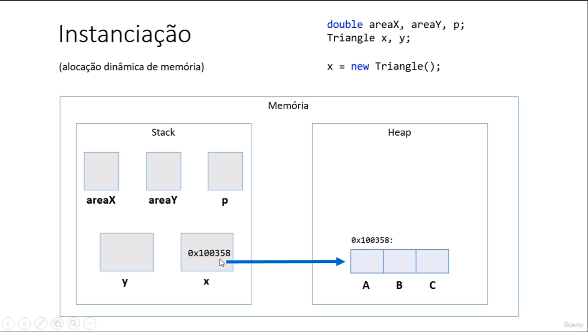

# Classe
- Toda classe em java é uma subclasse Object
- Objeto possui metodos
  - getClass -> retorna tipo do obj
  - equals -> comapra se obj é igual a outro
  - hashCode -> retorna um codigo hash do projeto
  - toString -> converte objeto para string 
- Criar uma constante 
```java
public final double PI = 3.14
```
## This
- usado para acessar objetos da propria classe ou passar o proprio objeto como argumento para um metodo ou contrutor
## Sobrecarga
- oferece mais de uma operação com mesmo nome porém com diferentes listas de parametros

# Memória
```java
double x, y
```
- criadas em uma área chamada **stack**, onde são criadas as **variaveis estáticas**

```java
Triangle x, y
Triangle x, y
```
- Ao colocar x = new Triangle();
  - cria um objeto do tipo triangle em uma área chamada **Heap**, onde são criados os **objetos dinâmicos**
  - variavel x **existe no stack** mas não contem os dados do tringulo e sim o **endereço de memória** que aponta para o objeto criado no **Heap**
  - **Ponteiro**
  - 

# Tipo referência x tipo valor
- Tipo referência
  - class são tipos referencias
  - é uma referencia para a caixa onde está o objeto atraves do ponteiro
  - aceitam valor "null"
  - objetos não utilizados não utilizados, são deslocados em momento proximo pelo garbage collector
  - ao atrobuir p2 = p1, p2 passa a apontar para mesmo endereço de memória do p1
  ```java
  Produto p1, p2;
  p1 = new Produto("TV", 900, 0);
  p2 = 2
  ``` 
- Tipo valor
  - tipos primitivos são do tipo valor
  - são caixas (recebe o valor) e não ponteiros
  - não aceitam valor null
  - "objetos" são desalocados imediatamente quando seu escopo de execução é finalizado
  - ao atribuir y = x, y recebe uma copia de x
  ```java
  double x, y
  x = 2.0
  y = x
  ``` 